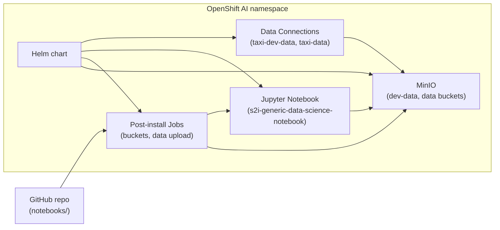

# Detect taxi fare anomalies with OpenShift AI

Deploy a data science workbench with MinIO storage and Jupyter notebooks to find anomalous taxi trips on OpenShift AI.

## Table of Contents

- [Overview](#overview)
- [Detailed description](#detailed-description)
  - [Architecture](#architecture)
- [Requirements](#requirements)
  - [Minimum hardware requirements](#minimum-hardware-requirements)
  - [Minimum software requirements](#minimum-software-requirements)
  - [Required user permissions](#required-user-permissions)
- [Deploy](#deploy)
  - [Prerequisites](#prerequisites)
  - [Installation](#installation)
  - [Validating the deployment](#validating-the-deployment)
  - [Delete](#delete)
- [Repository structure](#repository-structure)
- [References](#references)
- [Technical details](#technical-details)
- [Tags](#tags)

## Overview

This quickstart helps transportation and mobility teams detect unusual taxi trips—such as inflated fares or implausible distances—using anomaly detection on OpenShift AI. It provisions MinIO object storage, loads sample taxi trip data, and delivers a Jupyter workbench with notebooks ready to run. After deploying, you can explore data connections in the OpenShift AI dashboard and run Isolation Forest models to flag outliers.

## Detailed description

Ride-hailing and taxi operators need to spot billing anomalies, fraud patterns, and data quality issues across large trip datasets. Manual review does not scale, and ad-hoc scripts lack the governed environment that enterprise AI platforms provide.

This quickstart addresses that gap by deploying a complete experimentation stack on OpenShift AI. A Helm chart installs MinIO with `dev-data` and `data` buckets, uploads synthetic taxi trip CSV data (including planted anomalies for demonstration), registers OpenShift AI data connections for both buckets, and launches a Standard Data Science Jupyter notebook synced from this repository.

In production, **Zetaris** can serve as the upstream data platform; MinIO holds working copies for experimentation on the cluster. The included notebooks walk through environment validation and anomaly detection with scikit-learn.

### Architecture



**Components deployed by the chart:**

| Component | Purpose |
|-----------|---------|
| MinIO (subchart) | S3-compatible storage with `dev-data` and `data` buckets |
| Post-install jobs | Create buckets, upload `taxi_trips.csv`, clone notebooks to PVC |
| Data connection secrets | OpenShift AI dashboard integration for MinIO buckets |
| Jupyter Notebook | OpenShift AI workbench with MinIO env vars pre-configured |

## Requirements

### Minimum hardware requirements

**MinIO:**

- CPU: 200m (request) / 2 vCPU (limit)
- Memory: 1 GiB (request) / 2 GiB (limit)
- Storage: 10 GiB persistent volume

**Jupyter Notebook:**

- CPU: 1 vCPU (request) / 2 vCPU (limit)
- Memory: 4 GiB (request) / 8 GiB (limit)
- Storage: 10 GiB persistent volume (workspace) + 1 GiB shared memory

No GPU is required.

### Minimum software requirements

- OpenShift 4.14 or later
- OpenShift AI 2.22 or later (tested with the `s2i-generic-data-science-notebook:2025.2` workbench image)
- `oc` CLI (version 4.14+) installed and authenticated
- `helm` CLI (version 3.12+) installed
- `make` (optional, for Makefile targets)

### Required user permissions

This quickstart can be deployed by any user with:

- Permission to create OpenShift projects
- Permission to deploy Helm charts in their project
- Access to the OpenShift AI dashboard to launch the notebook workbench

No cluster admin access is required.

## Deploy

### Prerequisites

Before deploying, ensure you have:

- Access to a Red Hat OpenShift cluster with OpenShift AI installed
- `oc` CLI authenticated to the cluster
- `helm` CLI installed
- Sufficient storage capacity for two 10 GiB persistent volume claims

### Installation

#### Option A: Using the Makefile (recommended)

The Makefile provides targets for project and chart lifecycle management. Override `NAMESPACE` as needed:

```bash
git clone https://github.com/rh-ai-quickstart/ai-taxi-anomaly-detector.git
cd ai-taxi-anomaly-detector

# Create the OpenShift project
make create-project NAMESPACE=ai-taxi-anomaly-detector

The Makefile auto-detects `notebook.username` (`oc whoami`) and `notebook.dashboard.host` (rhods-dashboard route). Override if needed:

```bash
make install NAMESPACE=ai-taxi-anomaly-detector \
  OPENSHIFT_USER="$(oc whoami)" \
  DASHBOARD_HOST="$(oc get route rhods-dashboard -n redhat-ods-applications -o jsonpath='{.spec.host}')"
```

#### Option B: Manual installation

1. Clone the repository:

```bash
git clone https://github.com/rh-ai-quickstart/ai-taxi-anomaly-detector.git
cd ai-taxi-anomaly-detector
```

2. Create a new OpenShift project:

```bash
NAMESPACE="ai-taxi-anomaly-detector"
oc new-project ${NAMESPACE}
```

3. Update chart dependencies and install:

```bash
helm dependency update ./chart
helm upgrade --install ai-taxi-anomaly-detector ./chart \
  --namespace ${NAMESPACE} \
  --wait \
  --timeout 15m
```

Post-install hooks automatically:

- Create MinIO buckets (`dev-data`, `data`)
- Upload synthetic `taxi_trips.csv` with planted anomalies to both buckets
- Clone notebooks from git into the workbench workspace via an initContainer

### Validating the deployment

1. Check that pods and jobs completed successfully:

```bash
oc get pods,jobs -n ${NAMESPACE}
```

Expected resources include a MinIO pod, the notebook workbench pod (with a git-sync initContainer), and completed post-install jobs (`*-minio-create-buckets`, `*-upload-taxi-data`).

2. Verify MinIO buckets contain data (from a pod with network access):

```bash
oc get secret minio -n ${NAMESPACE} -o jsonpath='{.data.user}' | base64 -d && echo
```

3. Open the OpenShift AI dashboard, select your project, and launch the **Taxi Anomaly Detector** workbench (visible under your OpenShift username).

4. In the workbench, open `notebooks/init_check.ipynb` to verify MinIO connectivity and data upload, then run `notebooks/taxi_anomaly_detector.ipynb` to detect anomalies with Isolation Forest.

5. Confirm data connections appear in the dashboard:

```bash
oc get secrets -n ${NAMESPACE} -l opendatahub.io/managed=true
```

You should see `taxi-dev-data` and `taxi-data` connection secrets.

### Delete

#### Using the Makefile

```bash
make uninstall NAMESPACE=ai-taxi-anomaly-detector
make delete-project NAMESPACE=ai-taxi-anomaly-detector
```

#### Manual deletion

1. Uninstall the Helm release:

```bash
helm uninstall ai-taxi-anomaly-detector --namespace ${NAMESPACE}
```

2. Delete the project (removes remaining resources including PVCs):

```bash
oc delete project ${NAMESPACE}
```

> **Note:** The notebook workspace PVC is annotated with `helm.sh/resource-policy: keep` and may persist after `helm uninstall` if it was already bound. Deleting the project removes it.

## Repository structure

```
.
├── Makefile                          # OpenShift project and Helm lifecycle targets
├── chart/                            # Helm chart for deploying the quickstart
│   ├── files/
│   │   └── notebooks/                # Optional embed source (notebook.notebooks.embedFromChart)
│   ├── Chart.yaml                    # Chart metadata and MinIO subchart dependency
│   ├── Chart.lock                    # Locked dependency versions
│   ├── values.yaml                   # MinIO, notebook, and data connection defaults
│   └── templates/
│       ├── _helpers.tpl              # Template helpers
│       ├── hooks/
│       │   ├── post-install-buckets.yaml   # Create MinIO buckets
│       │   └── post-install-upload-data.yaml  # Upload taxi_trips.csv
│       ├── notebook/
│       │   ├── notebooks-configmap.yaml  # Embeds notebooks from chart/files/notebooks
│       │   ├── copy-notebooks.yaml   # Optional hook Job (gitSync.useJob; requires RWX PVC)
│       │   ├── data-connections.yaml # OpenShift AI S3 data connection secrets
│       │   ├── notebook.yaml         # Kubeflow Notebook workbench
│       │   └── pvc.yaml              # Notebook workspace storage
│       └── rbac/
│           └── serviceaccount.yaml   # Service account for setup jobs
├── notebooks/
│   ├── init_check.ipynb              # Verify MinIO connectivity and uploaded data
│   └── taxi_anomaly_detector.ipynb   # Isolation Forest anomaly detection demo
└── README.md
```

## References

- [OpenShift AI Documentation](https://docs.redhat.com/en/openshift_ai)
- [ai-architecture-charts MinIO chart](https://github.com/rh-ai-quickstart/ai-architecture-charts)
- [scikit-learn Isolation Forest](https://scikit-learn.org/stable/modules/generated/sklearn.ensemble.IsolationForest.html)

## Technical details

**Chart:** `ai-taxi-anomaly-detector` v0.1.0

**MinIO subchart:** `minio` v0.5.5 from [ai-architecture-charts](https://rh-ai-quickstart.github.io/ai-architecture-charts)

**Default MinIO credentials** (override in production via `values.yaml`):

| Key | Value |
|-----|-------|
| User | `taxi_minio_user` |
| Password | `taxi_minio_password` |
| Endpoint | `http://minio:9000` |

**Synthetic dataset:** 500 taxi trips with columns `trip_id`, `vendor_id`, `pickup_datetime`, `passenger_count`, `trip_distance`, `fare_amount`, `tip_amount`. Ten rows contain injected distance/fare anomalies.

**Notebook image:** `s2i-generic-data-science-notebook:2025.2` from the cluster's `redhat-ods-applications` image stream. List available tags with `oc get imagestreamtag -n redhat-ods-applications | grep datascience`.

**Notebook configuration:** The chart sets `notebooks.opendatahub.io/inject-oauth: "true"` (oauth-proxy sidecar for dashboard access), `opendatahub.io/username` (your OpenShift user), and `ServerApp.tornado_settings` with the RHODS dashboard host so workbench links resolve correctly.

Notebooks are cloned from git via an **initContainer** (`notebook.gitSync`). If `notebooks/` is not yet on the configured branch, `notebook.gitSync.fallbackToEmbedded: true` copies the chart-bundled notebooks from `chart/files/notebooks` so the workbench still starts.

**Environment variables** injected into the notebook for S3 access: `AWS_ACCESS_KEY_ID`, `AWS_SECRET_ACCESS_KEY`, `AWS_S3_ENDPOINT`, `AWS_DEFAULT_REGION`, `AWS_S3_BUCKET`, `TAXI_DATA_BUCKET`, `TAXI_DEV_DATA_BUCKET`, `TAXI_DATA_OBJECT`.

**Anomaly detection:** `IsolationForest(contamination=0.02)` on `passenger_count`, `trip_distance`, `fare_amount`, and `tip_amount`.

## Tags

**Title:** Detect taxi fare anomalies with OpenShift AI  
**Description:** Deploy a data science workbench with MinIO storage and Jupyter notebooks to find anomalous taxi trips on OpenShift AI.  
**Industry:** Transportation  
**Product:** OpenShift AI  
**Use case:** Anomaly detection, data science  
**Partner:** Zetaris  
**Contributor org:** Red Hat
