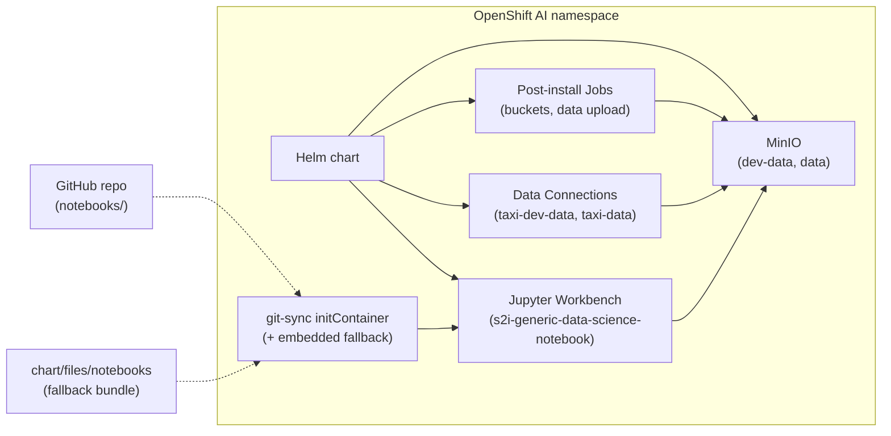

# Detect taxi fare anomalies with OpenShift AI

Deploy a data science workbench with MinIO storage and Jupyter notebooks to find anomalous taxi trips on OpenShift AI.

## Table of Contents

- [Overview](#overview)
- [Detailed description](#detailed-description)
  - [Architecture](#architecture)
- [Requirements](#requirements)
  - [Minimum hardware requirements](#minimum-hardware-requirements)
  - [Minimum software requirements](#minimum-software-requirements)
  - [Required user permissions](#required-user-permissions)
- [Deploy](#deploy)
  - [Prerequisites](#prerequisites)
  - [Installation](#installation)
  - [Configuration](#configuration)
  - [Validating the deployment](#validating-the-deployment)
  - [Delete](#delete)
- [Troubleshooting](#troubleshooting)
- [Repository structure](#repository-structure)
- [References](#references)
- [Technical details](#technical-details)
- [Tags](#tags)

## Overview

This quickstart helps transportation and mobility teams detect unusual taxi trips—such as inflated fares or implausible distances—using anomaly detection on OpenShift AI. It provisions MinIO object storage, loads sample taxi trip data, and delivers a Jupyter workbench with notebooks ready to run. After deploying, you can explore data connections in the OpenShift AI dashboard and run Isolation Forest models to flag outliers.

## Detailed description

Ride-hailing and taxi operators need to spot billing anomalies, fraud patterns, and data quality issues across large trip datasets. Manual review does not scale, and ad-hoc scripts lack the governed environment that enterprise AI platforms provide.

This quickstart addresses that gap by deploying a complete experimentation stack on OpenShift AI. A Helm chart installs:

- **MinIO** with `dev-data` and `data` buckets (S3-compatible object storage)
- **Post-install jobs** that create buckets and import NYC TLC trip record parquet files
- **OpenShift AI data connections** for both MinIO buckets
- **A Standard Data Science Jupyter workbench** with MinIO credentials and notebooks pre-configured

In production, **Zetaris** can serve as the upstream data platform; MinIO holds working copies for experimentation on the cluster. The included notebooks walk through environment validation and anomaly detection with scikit-learn.

### Architecture



**Components deployed by the chart:**

| Component | Purpose |
|-----------|---------|
| MinIO (subchart) | S3-compatible storage with `dev-data` and `data` buckets |
| Post-install jobs | Create buckets and import NYC TLC parquet trip data into MinIO |
| Data connection secrets | OpenShift AI dashboard integration for MinIO buckets |
| Jupyter Notebook | OpenShift AI workbench with MinIO env vars and OAuth proxy |
| git-sync initContainer | Clones `notebooks/` from git; falls back to chart bundle if missing |
| Service account | `taxi-anomaly-service-account` shared by MinIO, jobs, and workbench |

## Requirements

### Minimum hardware requirements

**MinIO:**

- CPU: 200m (request) / 2 vCPU (limit)
- Memory: 1 GiB (request) / 2 GiB (limit)
- Storage: 10 GiB persistent volume

**Jupyter Notebook:**

- CPU: 1 vCPU (request) / 2 vCPU (limit)
- Memory: 4 GiB (request) / 8 GiB (limit)
- Storage: 10 GiB persistent volume (workspace) + 1 GiB shared memory

**Cluster headroom:** OpenShift AI platform components (Kueue, dashboard, notebook controller) also consume worker CPU. Ensure workers have free capacity before installing.

No GPU is required.

### Minimum software requirements

- OpenShift 4.14 or later
- OpenShift AI 2.22 or later (tested with `s2i-generic-data-science-notebook:2025.2`)
- `oc` CLI (version 4.14+) installed and authenticated
- `helm` CLI (version 3.12+) installed
- `make` (optional, for Makefile targets)

Verify OpenShift AI is healthy before installing:

```bash
oc get datasciencecluster -A
oc get pods -n redhat-ods-applications
oc get route rhods-dashboard -n redhat-ods-applications
```

### Required user permissions

This quickstart can be deployed by any user with:

- Permission to create OpenShift projects
- Permission to deploy Helm charts in their project
- Access to the OpenShift AI dashboard to launch the workbench

No cluster admin access is required.

## Deploy

### Prerequisites

Before deploying, ensure you have:

- A Red Hat OpenShift cluster with **OpenShift AI installed and healthy**
- `oc` CLI authenticated to the cluster
- `helm` CLI installed
- Sufficient storage for two 10 GiB persistent volume claims (MinIO + notebook workspace)
- A workbench image tag that exists on your cluster:

```bash
oc get imagestreamtag -n redhat-ods-applications | grep generic-data-science
```

### Installation

#### Option A: Using the Makefile (recommended)

The Makefile manages project creation, Helm install/uninstall, and auto-detects OpenShift AI settings:

| Variable | Default | Description |
|----------|---------|-------------|
| `NAMESPACE` | `ai-taxi-anomaly-detector` | OpenShift project name |
| `RELEASE_NAME` | `ai-taxi-anomaly-detector` | Helm release name |
| `OPENSHIFT_USER` | `oc whoami` | Workbench owner (required) |
| `DASHBOARD_HOST` | rhods-dashboard route host | Required for dashboard links |
| `TIMEOUT` | `15m` | Helm `--wait` timeout |

```bash
git clone https://github.com/rh-ai-quickstart/ai-taxi-anomaly-detector.git
cd ai-taxi-anomaly-detector

# Create the OpenShift project
make create-project NAMESPACE=ai-taxi-anomaly-detector

# Install (auto-detects oc whoami and rhods-dashboard route)
make install NAMESPACE=ai-taxi-anomaly-detector
```

Override detection if needed:

```bash
make install NAMESPACE=my-taxi-demo \
  OPENSHIFT_USER="$(oc whoami)" \
  DASHBOARD_HOST="$(oc get route rhods-dashboard -n redhat-ods-applications -o jsonpath='{.spec.host}')"
```

#### Option B: Manual installation

1. Clone the repository:

```bash
git clone https://github.com/rh-ai-quickstart/ai-taxi-anomaly-detector.git
cd ai-taxi-anomaly-detector
```

2. Create a new OpenShift project:

```bash
NAMESPACE="ai-taxi-anomaly-detector"
oc new-project ${NAMESPACE}
```

3. Update chart dependencies and install:

```bash
helm dependency update ./chart
helm upgrade --install ai-taxi-anomaly-detector ./chart \
  --namespace ${NAMESPACE} \
  --set notebook.username="$(oc whoami)" \
  --set notebook.dashboard.host="$(oc get route rhods-dashboard -n redhat-ods-applications -o jsonpath='{.spec.host}')" \
  --wait \
  --timeout 15m
```

### Configuration

Key values in `chart/values.yaml`:

| Value | Default | Notes |
|-------|---------|-------|
| `minio.buckets.names` | `dev-data`, `data` | Use hyphens only (S3 bucket naming rules) |
| `dataImport.enabled` | `true` | Import NYC TLC parquet files after bucket creation |
| `dataImport.startYear` / `startMonth` | `2025` / `10` | First month to import (inclusive) |
| `dataImport.endYear` / `endMonth` | `2026` / `1` | Last month to import (inclusive) |
| `dataImport.tripTypes` | yellow, green, fhv, fhvhv | TLC dataset prefixes; files are `{type}_{YYYY-MM}.parquet` |
| `dataImport.buckets` | `data` | MinIO buckets to receive imported files |
| `dataImport.prefix` | `tlc-trip-data` | Object key prefix under each bucket |
| `minio.serviceAccount.name` | `taxi-anomaly-service-account` | Must match parent `serviceAccount.name` |
| `notebook.image.tag` | `2025.2` | Match a tag on your cluster's image stream |
| `notebook.username` | _(required at install)_ | Set to `oc whoami` output |
| `notebook.dashboard.host` | _(required at install)_ | RHODS dashboard route host (no `https://`) |
| `notebook.gitSync.enabled` | `true` | Clone notebooks from git via initContainer |
| `notebook.gitSync.fallbackToEmbedded` | `true` | Use `chart/files/notebooks` when git has no `notebooks/` |
| `notebook.gitSync.repo` | `rh-ai-quickstart/ai-taxi-anomaly-detector` | HTTPS git URL |
| `notebook.gitSync.useJob` | `false` | Set `true` only with ReadWriteMany PVCs |

**Notebook delivery modes:**

1. **Git sync with fallback (default):** initContainer clones from git; if `notebooks/` is missing on the branch, copies bundled notebooks from the chart ConfigMap.
2. **Git sync only:** `notebook.gitSync.fallbackToEmbedded: false` — fails until `notebooks/` exists on the configured branch.
3. **Chart embed only:** `notebook.gitSync.enabled: false` and `notebook.notebooks.embedFromChart: true`.
4. **Hook Job (advanced):** `notebook.gitSync.useJob: true` — separate post-install Job; requires an RWX storage class to avoid multi-attach errors on the default RWO PVC.

### Validating the deployment

1. Check pods and jobs:

```bash
oc get pods,jobs -n ${NAMESPACE}
```

Expected resources:

- `pod/minio-0` — Running
- `pod/ai-taxi-anomaly-detector-notebook-0` — Running (with completed `git-sync-notebooks` initContainer)
- `job/ai-taxi-anomaly-detector-minio-create-buckets` — Complete
- `job/ai-taxi-anomaly-detector-import-taxi-data` — Complete (when `dataImport.enabled`)
2. Verify MinIO routes and credentials:

```bash
oc get routes -n ${NAMESPACE} | grep minio
oc get secret minio -n ${NAMESPACE} -o jsonpath='{.data.user}' | base64 -d && echo
```

3. Open the OpenShift AI dashboard, select your project, and launch the **Taxi Anomaly Detector** workbench under your OpenShift username.

4. Run the notebooks:

- `notebooks/init_check.ipynb` — verify MinIO connectivity and uploaded data
- `notebooks/taxi_anomaly_detector.ipynb` — Isolation Forest anomaly detection

5. Confirm data connections:

```bash
oc get secrets -n ${NAMESPACE} -l opendatahub.io/managed=true
```

You should see `taxi-dev-data` and `taxi-data`.

6. Restart the workbench after chart upgrades that change notebooks:

```bash
oc delete pod -n ${NAMESPACE} -l notebook-name=ai-taxi-anomaly-detector-notebook
```

### Delete

#### Using the Makefile

```bash
make uninstall NAMESPACE=ai-taxi-anomaly-detector
make delete-project NAMESPACE=ai-taxi-anomaly-detector
```

#### Manual deletion

```bash
helm uninstall ai-taxi-anomaly-detector --namespace ${NAMESPACE}
oc delete project ${NAMESPACE}
```

> **Note:** The notebook workspace PVC uses `helm.sh/resource-policy: keep` and may survive `helm uninstall`. Deleting the project removes it.

## Troubleshooting

| Symptom | Likely cause | Fix |
|---------|--------------|-----|
| `no matches for kind "Notebook"` | OpenShift AI not installed | Install OpenShift AI; verify `oc api-resources --api-group=kubeflow.org` |
| Webhook `no endpoints available` | ODS/Kueue pods not running | Fix pods in `redhat-ods-applications`; free worker CPU |
| `ErrImagePull` for workbench image | Image tag missing on cluster | `oc get imagestreamtag -n redhat-ods-applications \| grep datascience`; update `notebook.image.tag` |
| Dashboard workbench link does not resolve | Wrong user or missing dashboard host | Set `notebook.username` to `oc whoami` and `notebook.dashboard.host` to rhods-dashboard route |
| `serviceaccount "taxi-anomaly-setup" not found` | Stale values | Ensure `minio.serviceAccount.name` matches `serviceAccount.name` (`taxi-anomaly-service-account`) |
| `InvalidBucketName` for `dev_data` | Underscores in bucket names | Use `dev-data` (hyphens only) |
| `Multi-Attach` on notebook PVC | Hook Job + workbench mount same RWO PVC | Use initContainer git sync (`useJob: false`, default) |
| `notebooks directory not found in repository` | `notebooks/` not on git branch | Push `notebooks/` to GitHub, or keep `fallbackToEmbedded: true` (default) |
| `git-sync-notebooks` CrashLoopBackOff | Git failed and fallback disabled | Set `notebook.gitSync.fallbackToEmbedded: true` |
| Helm `another operation is in progress` | Cancelled or stuck install | `helm history <release> -n <ns>` then `helm rollback` |
| MinIO pod Pending | Insufficient worker CPU | Free cluster resources or add worker capacity |

## Repository structure

```
.
├── Makefile                          # OpenShift project and Helm lifecycle targets
├── chart/                            # Helm chart
│   ├── files/
│   │   └── notebooks/                # Symlink to ../../notebooks (gitSync fallback bundle)
│   ├── Chart.yaml                    # Chart metadata; MinIO subchart dependency
│   ├── Chart.lock                    # Locked dependency versions
│   ├── values.yaml                   # Default configuration
│   └── templates/
│       ├── _helpers.tpl
│       ├── hooks/
│       │   ├── post-install-buckets.yaml
│       │   └── post-install-import-taxi-data.yaml
│       ├── notebook/
│       │   ├── _git-sync.tpl           # Git clone + embedded fallback script
│       │   ├── copy-notebooks.yaml     # Optional hook Job (gitSync.useJob)
│       │   ├── data-connections.yaml
│       │   ├── notebook.yaml           # Kubeflow Notebook workbench
│       │   ├── notebooks-configmap.yaml
│       │   └── pvc.yaml
│       └── rbac/
│           └── serviceaccount.yaml
├── notebooks/
│   ├── init_check.ipynb
│   └── taxi_anomaly_detector.ipynb
└── README.md
```

## References

- [OpenShift AI Documentation](https://docs.redhat.com/en/openshift_ai)
- [Creating a workbench (Notebook CRD)](https://opendatahub.io/docs/api-workbench/)
- [ai-architecture-charts MinIO chart](https://github.com/rh-ai-quickstart/ai-architecture-charts)
- [NYC TLC Trip Record Data](https://www.nyc.gov/site/tlc/about/tlc-trip-record-data.page)
- [scikit-learn Isolation Forest](https://scikit-learn.org/stable/modules/generated/sklearn.ensemble.IsolationForest.html)

## Technical details

**Chart:** `ai-taxi-anomaly-detector` v0.1.0

**MinIO subchart:** `minio` v0.5.5 from [ai-architecture-charts](https://rh-ai-quickstart.github.io/ai-architecture-charts)

**Default MinIO credentials** (override in production):

| Key | Value |
|-----|-------|
| User | `taxi_minio_user` |
| Password | `taxi_minio_password` |
| Endpoint | `http://minio:9000` |
| Buckets | `dev-data`, `data` |
| TLC import prefix | `tlc-trip-data/{tripType}_{YYYY-MM}.parquet` |

**NYC TLC import:** Post-install job downloads parquet files from `https://d37ci6vzurychx.cloudfront.net/trip-data/` for each configured month and trip type (`yellow_tripdata`, `green_tripdata`, `fhv_tripdata`, `fhvhv_tripdata`). TLC data is published roughly two months behind the current calendar month — adjust `dataImport.endYear` / `endMonth` accordingly. Large date ranges can exceed the default 10 GiB MinIO volume.

**Workbench image:** `s2i-generic-data-science-notebook:2025.2` from `redhat-ods-applications`. List tags with:

```bash
oc get imagestreamtag -n redhat-ods-applications | grep generic-data-science
```

**Workbench OpenShift AI integration:**

- `notebooks.opendatahub.io/inject-oauth: "true"` — oauth-proxy sidecar for dashboard access
- `opendatahub.io/username` — must match `oc whoami`
- `ServerApp.tornado_settings` — dashboard host and project prefix for correct URLs

**Notebook environment variables:** `AWS_ACCESS_KEY_ID`, `AWS_SECRET_ACCESS_KEY`, `AWS_S3_ENDPOINT`, `AWS_DEFAULT_REGION`, `AWS_S3_BUCKET`, `TAXI_DATA_BUCKET`, `TAXI_DEV_DATA_BUCKET`, `TAXI_DATA_PREFIX`, `TAXI_DATA_TRIP_TYPE`

**Anomaly detection:** `IsolationForest(contamination=0.02)` on `passenger_count`, `trip_distance`, `fare_amount`, `tip_amount`

## Tags

**Title:** Detect taxi fare anomalies with OpenShift AI  
**Description:** Deploy a data science workbench with MinIO storage and Jupyter notebooks to find anomalous taxi trips on OpenShift AI.  
**Industry:** Transportation  
**Product:** OpenShift AI  
**Use case:** Anomaly detection, data science  
**Partner:** Zetaris  
**Contributor org:** Red Hat
